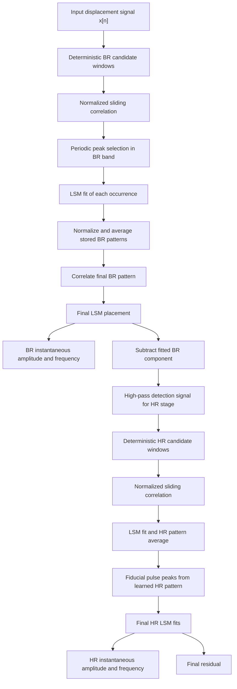

# Sliding Pattern Vital Extraction

This report describes `sliding_pattern_vitals_challenge.py`, a standalone Python script that implements deterministic sliding-window correlation, least-squares pattern fitting, pattern averaging, suppression, and instantaneous metric extraction for respiration-like and heart-like displacement signals.

Run:

```bash
uv run sliding_pattern_vitals_challenge.py
uv run sliding_pattern_vitals_challenge.py --demo --output-dir sliding_pattern_demo_output
```

The production entry point is:

```python
from sliding_pattern_vitals_challenge import extract_vital_patterns

result = extract_vital_patterns(sig, fs)
breath = result.by_name("breath")
heart = result.by_name("heart")
```

Each stage returns `instantaneous_frequency_hz`, `instantaneous_amplitude`, `pattern`, `event_times_s`, the fitted component, and the residual signal.

## Block Diagram



## Equations

For a candidate pattern \(p[k]\) of length \(M\), the normalized sliding correlation at offset \(i\) is

$$
\rho[i] =
\frac{\sum_{k=0}^{M-1} \left(x[i+k]-\bar{x}_i\right)\left(p[k]-\bar{p}\right)}
{\sqrt{\sum_{k=0}^{M-1}\left(x[i+k]-\bar{x}_i\right)^2}
\sqrt{\sum_{k=0}^{M-1}\left(p[k]-\bar{p}\right)^2}} .
$$

For each detected occurrence, the fitted model is

$$
\hat{x}(t_j) =
\left(\beta_0 + \beta_1 u_j\right)p(u_j) + c,
\qquad
u_j = \frac{t_j - t_s}{T_s},
\qquad
0 \le u_j \le 1 .
$$

The nonlinear variables are the start shift and stretch:

$$
t_s = t_{0} + \tau,
\qquad
T_s = \alpha T_0 .
$$

For each proposed \((\tau,\alpha)\), the linear coefficients are solved by least squares:

$$
\underset{\beta_0,\beta_1,c}{\operatorname{argmin}}
\sum_{j}
\left[
x(t_j) -
\left(\left(\beta_0+\beta_1 u_j\right)p(u_j)+c\right)
\right]^2 .
$$

Stored patterns are normalized back into the unit pattern coordinate:

$$
\tilde{p}_r(u_j) =
\frac{x_r(t_j)-c_r}{\beta_{0,r}+\beta_{1,r}u_j},
$$

then resampled to a common grid and combined by the median:

$$
p_{\mathrm{avg}}(u) =
\operatorname{median}_{r}\left(\tilde{p}_r(u)\right).
$$

The event-to-event instantaneous frequency is

$$
f_{\mathrm{inst}}(t_m) =
\frac{1}{e_{m+1}-e_m},
\qquad
t_m = \frac{e_m + e_{m+1}}{2},
$$

then linearly interpolated onto the sample grid and lightly smoothed. Amplitude is the robust half peak-to-peak value of each fitted component:

$$
A_r =
\frac{Q_{95}\left(\hat{x}_r(t)\right)-Q_{5}\left(\hat{x}_r(t)\right)}{2}.
$$

## Parameters

Default stage settings:

| Stage | Band | Window | Candidate windows | Fit stretch | Notes |
|---|---:|---:|---:|---:|---|
| Breath | \(0.18\)-\(0.60\) Hz | \(4.0\) s | 12 | \(0.62\)-\(1.55\) | full signal residual is used |
| Heart | \(0.75\)-\(3.0\) Hz | \(1.05\) s | 14 | \(0.62\)-\(1.45\) | uses \(0.55\) Hz high-pass detection after BR suppression |

The most sensitive parameters are the first-stage breath window length, the breath subtraction taper, and the HR fiducial peak distance. A shorter BR window responds faster but learns less of the respiratory waveform. A longer BR window suppresses breathing more cleanly but can lag stronger nonstationarity. The current default favors stable extraction on the provided 60 s synthetic case rather than aggressive tracking.

## Current Benchmark

Command:

```bash
python sliding_pattern_vitals_challenge.py
```

Result after the requested 10 s grace period:

| Metric | Value |
|---|---:|
| BR frequency MAE | \(0.0144\) Hz |
| BR frequency RMSE | \(0.0313\) Hz |
| BR amplitude MAE | \(0.0242\) |
| BR amplitude RMSE | \(0.0254\) |
| HR frequency MAE | \(0.0304\) Hz |
| HR frequency RMSE | \(0.0655\) Hz |
| HR amplitude MAE | \(0.0193\) |
| HR amplitude RMSE | \(0.0381\) |

A stress run with added noise and stronger frequency slopes:

```bash
uv run sliding_pattern_vitals_challenge.py --noise-std 0.01 --br-mod-scale 0.18 --hr-mod-scale 0.25
```

showed the method is notably more sensitive in the HR stage, with HR frequency MAE around \(0.17\) Hz. The main failure mode is imperfect BR suppression shifting or hiding HR fiducial peaks. In practice, this means HR robustness will depend on improving the first-stage suppression or adding a more formal event-selection tracker after the learned HR pattern is available.

## Demo Figures

The introductory demo writes:

| File | Contents |
|---|---|
| `00_components.png` | input, fitted components, and residuals |
| `10_breath_candidate_correlation.png` | BR candidate windows, correlations, peaks, and average pattern |
| `20_breath_fit_average_suppress.png` | stored BR patterns, final BR fits, and suppressed signal |
| `10_heart_candidate_correlation.png` | HR candidate windows, correlations, peaks, and average pattern |
| `20_heart_fit_average_suppress.png` | stored HR patterns, final HR fits, and suppressed signal |
| `90_instantaneous_metrics.png` | estimated instantaneous frequencies and amplitudes versus synthetic truth |
